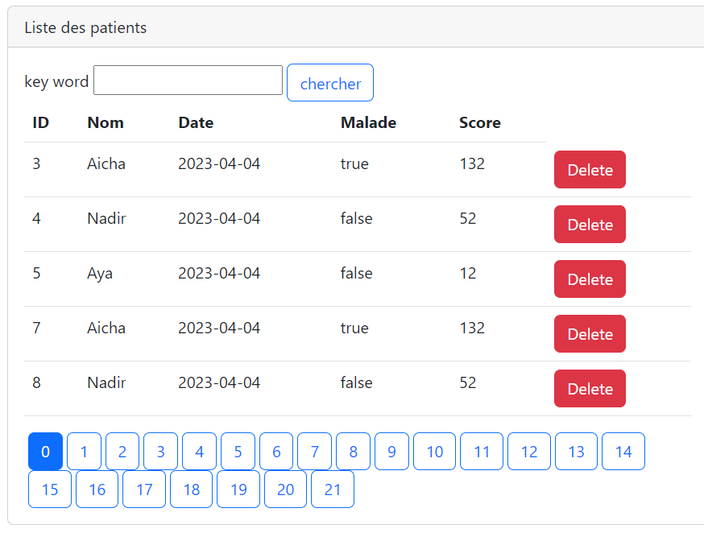
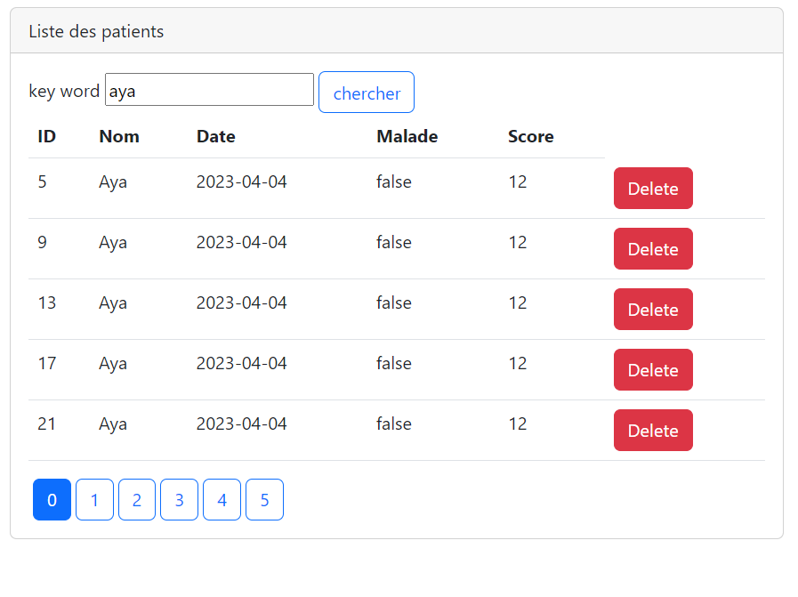
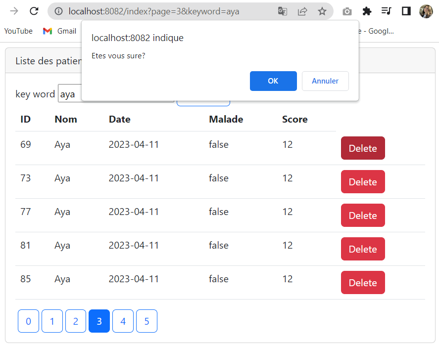

# patients_mvc

    L'interface présente une liste des patients avec un label pour chercher un patient par son nom
    Le bouton delete permet de supprimer un patient avec un alert

<h5>Pagination</h5>

<h5>Recherche</h5>

Ici La pagination marche toujours avec la recherche des patients

<h5>Suppression</h5>

L'orsqu'on click sur le button Delete un message de confirmation s'affiche

